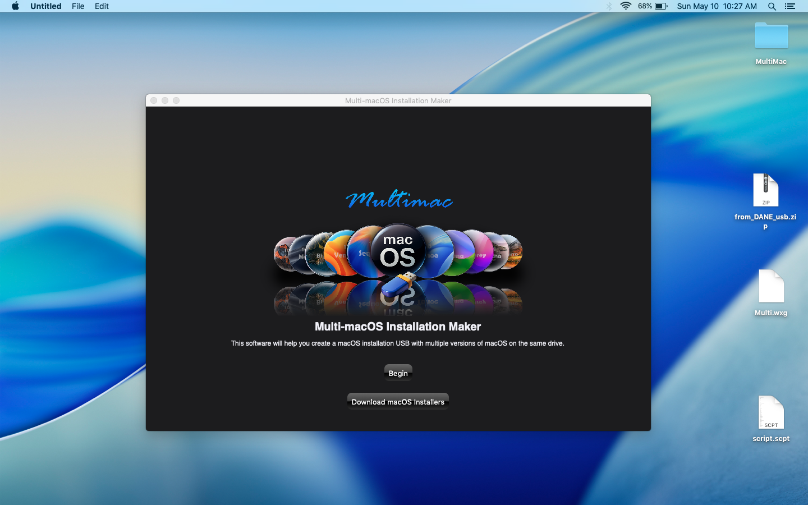
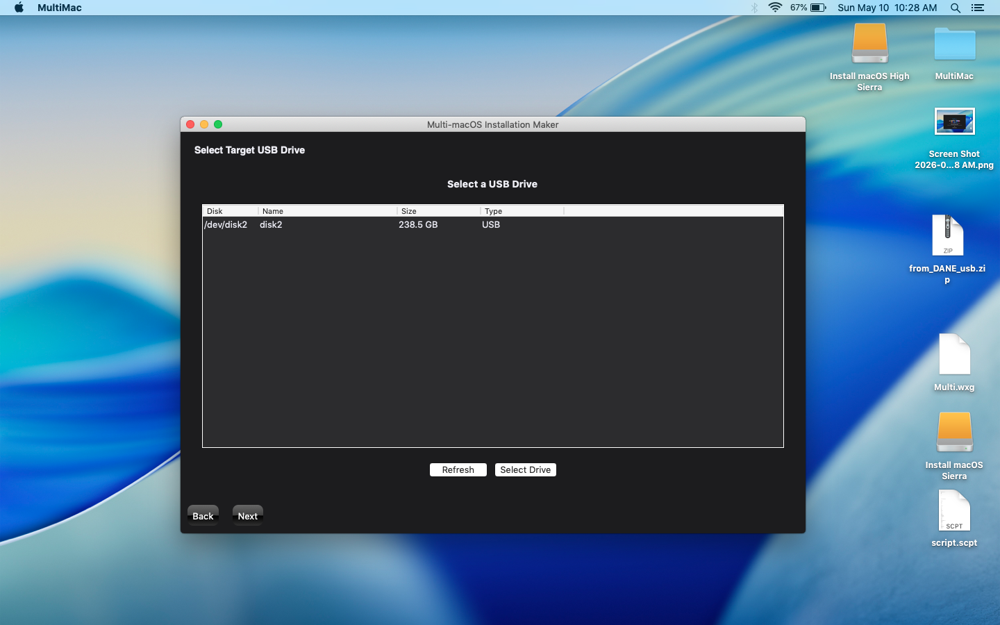
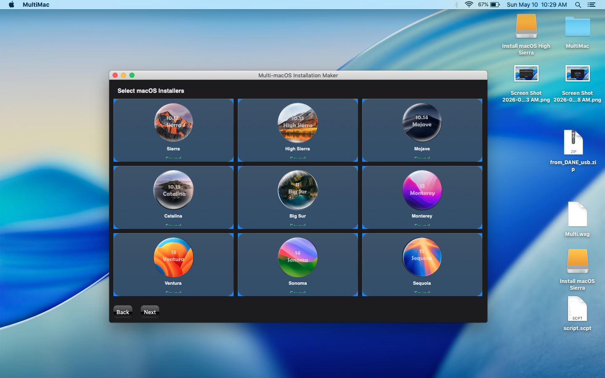
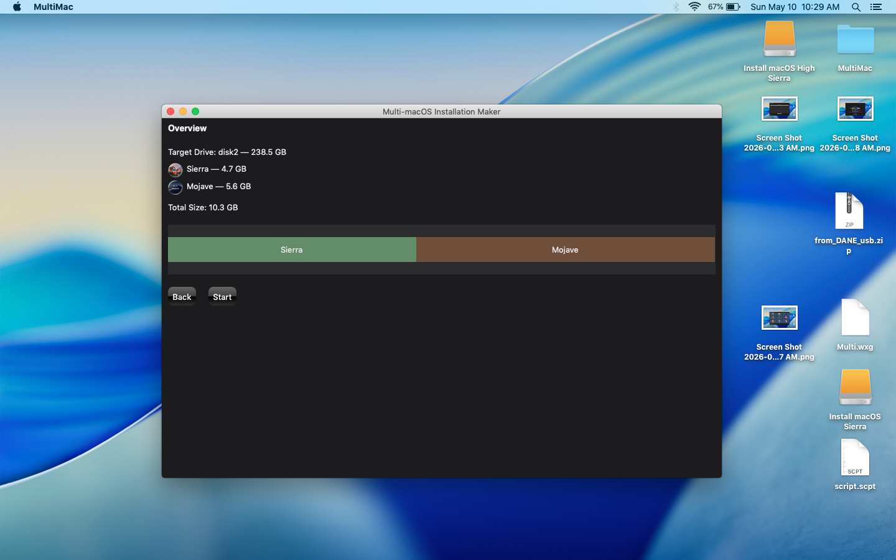
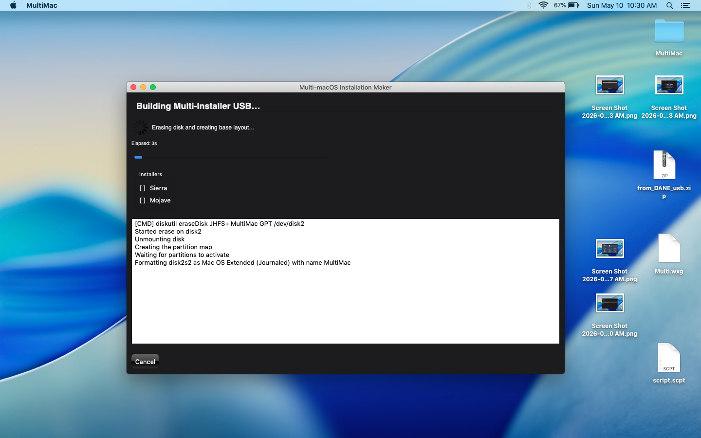
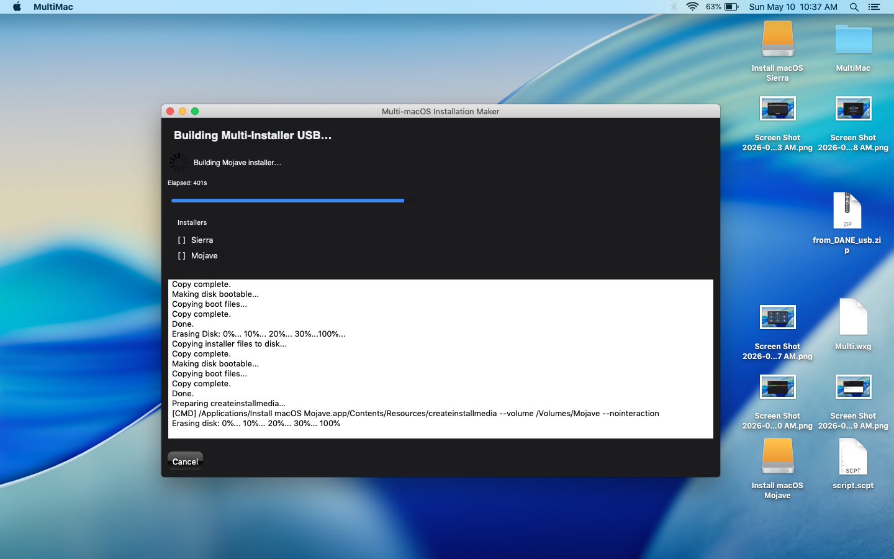
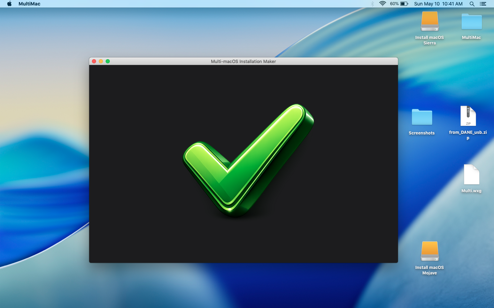

# **MultiMac — Multi‑macOS USB Installer Builder**

A fast, reliable, GUI‑driven tool for creating **multiple macOS installers on a single USB drive**.  
MultiMac automatically partitions the target disk, formats each slice, and runs Apple’s official `createinstallmedia` for every macOS version you select.

Built for technicians, power users, and anyone who maintains multiple Macs.

---

## ✨ Features
- **Multi‑installer USB creation** — build 2–8 macOS installers on one drive  
- **Automatic GPT partitioning** using raw‑device access  
- **Automatic `createinstallmedia` execution** for each installer  
- **Modern Python 3.12 engine**  
- **PyInstaller‑bundled macOS app**  
- **Sudo Companion launcher** for proper elevated execution  
- **Clean, simple GUI** built with wxPython  
- **Full logging** to `~/MultiMacOSInstaller.log`

---

## Screenshots

  

  

  

  

  

  

  

## 🖥️ Supported macOS Versions
MultiMac supports all macOS installers that use `createinstallmedia`, including:

- macOS Sierra  
- macOS High Sierra  
- macOS Mojave  
- macOS Catalina  
- macOS Big Sur  
- macOS Monterey  
- macOS Ventura  
- macOS Sonoma  
- macOS Sequoia  

---

## 🧰 Requirements
- macOS host system  
- Python not required for end‑users (PyInstaller bundle)  
- USB drive **32GB minimum** (64GB+ recommended)  
- Official macOS installer apps in `/Applications`

---

## 🚀 Installation
Download the latest release from the Releases page and place both apps in `/Applications`:

- **MultiMac.app**  
- **MultiMac Launcher.app**

The MultiMac Launcher is required because macOS GUI apps cannot self‑elevate.  
It launches MultiMac with proper root privileges.

---

## 🔧 Usage
1. Launch **MultiMac Launcher.app**  
2. Enter your administrator password  
3. MultiMac opens with full root privileges 
4. Select your target USB drive 
5. Select your macOS installers  
6. Preview build summary and click next  
7. Click **Start**  
8. MultiMac will:
   - Erase the disk  
   - Create GPT partitions  
   - Format each slice  
   - Run `createinstallmedia` for each installer  

---

## 📄 License
MIT License

---

## 📬 Contact
For issues, feature requests, or questions, open a GitHub Issue.
