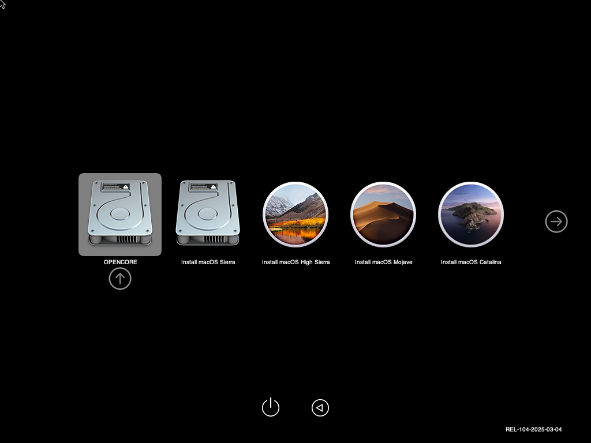
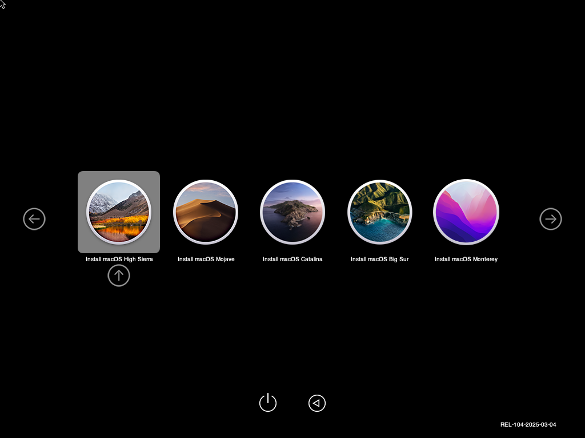
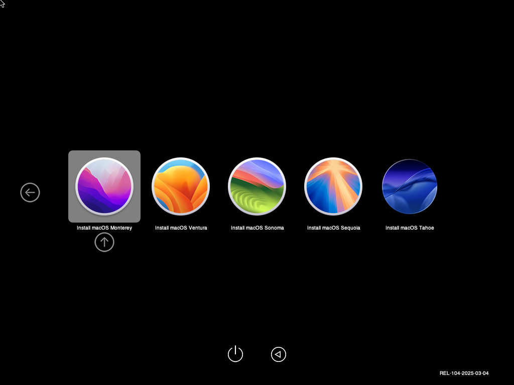

# **MultiMac — An AIO macOS Installation maker**

Make yourself a Bootable macOS Install USB Drive wih as many versions of macOS as you want or Make one USB drive that contains all 10.

This tool was built for technicians, power users, and anyone who maintains multiple Macs.

---

## ✨ Features
- If you are missing any of the macOS Installers you can download them from inside the app
- (Added in Version 2.0) You can convert any macOS Inatall.app to ISO to attach to a new Virtual Machine CD/DVD drive so you can boot up a mac and install macOS.

---

## Screenshots

  

  

  

  

  

  

  

  

  

  

## 🖥️ Supported macOS Versions
MultiMac supports all macOS installers from the "macOS Era"

- macOS 10.12 Sierra  
- macOS 10.13 High Sierra  
- macOS 10.14 Mojave  
- macOS 10.15 Catalina  
- macOS 11 Big Sur  
- macOS 12 Monterey  
- macOS 13 Ventura  
- macOS 14 Sonoma  
- macOS 15 Sequoia
- macOS 26 Tahoe  

---

## 🧰 Requirements
- System running macOS
-   
- USB drive **32GB minimum** (64GB+ recommended) This depends on how many installers you want to include on your drive.
- 
- macOS installer apps located in `/Applications`

---

## 🚀 Installation
Download the latest release from the Releases page and place both apps in `/Applications`:

- **MultiMac.app**  
- **MultiMac Launcher.app**

The MultiMac Launcher is required to launch MultiMac with proper root privileges.

---

## 🔧 Usage
1. Launch **MultiMac Launcher.app**  
2. Enter your administrator password  
3. Select your target USB drive 
4. Select your macOS installers  
6. Preview build summary and click next  
7. Click **Start**  
8. Wait for your Build to Finish 

---

## 📄 License
MIT License

---

## 📬 Contact
For issues, feature requests, or questions, open a GitHub Issue.
